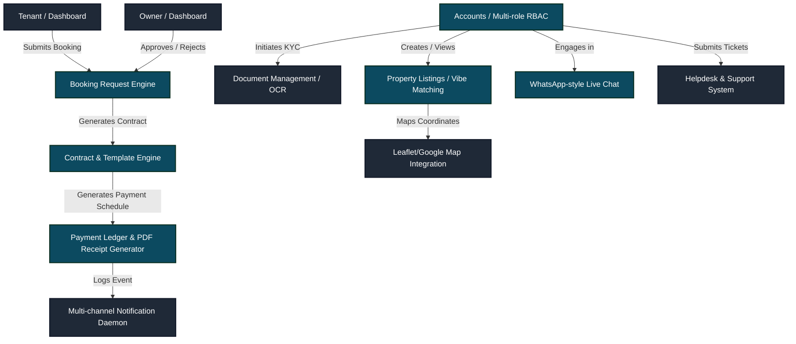

# BrosDen: One Stop Housing Solution - (College Project)

# <p align="center"></p>

<p align="center">
  
  
  
  
  
  
</p>

---

## 🌟 Vision & Mission

**NIRVANA** (also known in active production environments as **BrosDen-AV**) is an enterprise-grade, secure, multi-role property rental and listing management platform. It addresses the fragmented, insecure nature of modern real estate platforms by providing a **unified digital ecosystem** that seamlessly integrates every stage of the rental lifecycle:

*   **Trust & Verification:** Zero-trust onboarding via automated **Tesseract OCR-based KYC verification** for owners and tenants.
*   **Intelligent Property Discovery:** Sophisticated listing configurations mapped to dynamic geo-location discovery and customized "Vibe Scores" (e.g., Party, Study, Quiet, Active).
*   **Legal Protection:** Integrated multi-party contract builder supporting custom templates, automated 12-month payment scheduling, and legally binding sign-offs.
*   **Direct & Real-Time Communication:** End-to-end encrypted messaging through a highly polished WhatsApp-style chat interface with read receipts.
*   **Secure Payment Streams:** Built-in dynamic invoice generators, automated PDF receipt engines, and a ledger reconciliation dashboard.

---

## 🗺️ Table of Contents
1. [Vision & Mission](#-vision--mission)
2. [Architecture & System Flow](#%EF%B8%8F-architecture--system-flow)
3. [Key Modules & Apps Directory](#-key-modules--apps-directory)
4. [Tech Stack](#-tech-stack)
5. [Directory Structure](#-directory-structure)
6. [Local Environment Setup](#%EF%B8%8F-local-environment-setup)
7. [OCR & Document Verification Setup](#-ocr--document-verification-setup)
8. [Feature Gap & Competitor Matrix](#-feature-gap--competitor-matrix)
9. [Roadmap (3-Month Evolution Plan)](#-roadmap-3-month-evolution-plan)
10. [License & Contribution](#-license--contribution)

---

## 🗺️ Architecture & System Flow

NIRVANA is built upon a highly decoupling, modular Django architecture consisting of **21 specialized sub-applications**. This separation of concerns ensures that the payment engine, chat systems, and user authentication routines can scale independently.



---

## 📦 Key Modules & Apps Directory

Below is the exhaustive catalog of custom-engineered Django applications running inside NIRVANA:

| App Directory | Core Purpose & Scope | Implemented Features |
| :--- | :--- | :--- |
| [core](file:///d:/ANTI-GRAVITY/BrosDen/core) | Base architecture, landing/home page, shared layouts, and cross-app utility services. | Common base classes, UI templates, base static assets. |
| [accounts](file:///d:/ANTI-GRAVITY/BrosDen/accounts) | Custom User authentication engine mapping distinct Role-Based Access Control (RBAC). | Roles: Admin, Owner, Tenant; KYC statuses, verification badges. |
| [property](file:///d:/ANTI-GRAVITY/BrosDen/property) | Multi-category property engine managing accommodation configurations. | Bed/BHK config, pricing structures, rent policies, availability. |
| [booking](file:///d:/ANTI-GRAVITY/BrosDen/booking) | End-to-end booking state machine connecting Tenants and Owners. | Pending, Approved, Rejected, Paid, Cancelled state triggers. |
| [chat](file:///d:/ANTI-GRAVITY/BrosDen/chat) | High-fidelity messaging system for tenant-owner negotiations. | Bubble threads, read/unread states, secure encryption badges. |
| [contract](file:///d:/ANTI-GRAVITY/BrosDen/contract) | Automated lease agreement dynamic generation engine. | Placeholders, 12-month automated schedules, double signing. |
| [payment](file:///d:/ANTI-GRAVITY/BrosDen/payment) | Accounts ledger, dynamic PDF generators, and transaction histories. | PDF Receipt output, company logos, unique invoice generation. |
| [dms](file:///d:/ANTI-GRAVITY/BrosDen/dms) | Secure Document Management System for tenant-owner profiles. | Secure uploads of Salary Slips, Leases, and Land Deeds. |
| [analytics](file:///d:/ANTI-GRAVITY/BrosDen/analytics) | Activity logging, search intent analysis, and performance tracking. | View counters, query logging, aggregated dashboard metrics. |
| [notifications](file:///d:/ANTI-GRAVITY/BrosDen/notifications) | Multi-channel dispatcher (Booking, Payments, System, Chat). | In-app alerts, dynamic email notifications templates. |
| [feedback](file:///d:/ANTI-GRAVITY/BrosDen/feedback) | Ongoing qualitative collection pipeline for tenant experiences. | Monthly surveys, rating trends, satisfaction reports. |
| [reviews](file:///d:/ANTI-GRAVITY/BrosDen/reviews) | Multi-directional rating matrices (Tenant ↔ Property ↔ Owner). | 5-star ratings, aggregated scoring, compliance histories. |
| [map](file:///d:/ANTI-GRAVITY/BrosDen/map) | Geographical plotting engine using coordinate mapping. | Radius searches, interactive map markers, landmark proximities. |
| [vibe](file:///d:/ANTI-GRAVITY/BrosDen/vibe) | Neighborhood compatibility matching system. | Vibe scores (residential, student-friendly, party-centric). |
| [wishlist](file:///d:/ANTI-GRAVITY/BrosDen/wishlist) | Bookmarking utility for bookmarking property files. | Property shortcuts, shareable collections. |
| [onboarding](file:///d:/ANTI-GRAVITY/BrosDen/onboarding) | Multi-phase greeting wizard and dynamic content boards. | User registration tutorials, blog and guidelines integrations. |
| [sys_admin](file:///d:/ANTI-GRAVITY/BrosDen/sys_admin) | Custom administrative interface for top-level operational staff. | Platform controls, KYC moderation queue, ledger audits. |
| [helpdesk](file:///d:/ANTI-GRAVITY/BrosDen/helpdesk) | Basic ticketing customer support workflow engine. | Ticket logs, category routing, support representative replies. |
| [mailer](file:///d:/ANTI-GRAVITY/BrosDen/mailer) | Dedicated SMTP transactional email builder. | Template generation, asynchronous queue handlers. |
| [database](file:///d:/ANTI-GRAVITY/BrosDen/database) | Database seeding, environment scripts, and structural schemas. | Initial fixtures, custom SQL seeds, database utilities. |

---

## 💻 Tech Stack

NIRVANA utilizes a robust, modern technology stack tailored for speed, async efficiency, and ease of deployment:

*   **Backend Framework:** Django `6.0.2` (ASGI/WSGI ready)
*   **Asynchronous Engine:** `asgiref==3.11.1`
*   **Database Integration:** Dynamic SQLite/PostgreSQL configuration ([dj_database_url](https://pypi.org/project/dj-database-url/), [psycopg2-binary](https://pypi.org/project/psycopg2-binary/))
*   **Dynamic Document Generation:** `xhtml2pdf>=0.2.14` (Automated PDF leasing and payment receipts)
*   **OCR Parsing Engines:** `pytesseract>=0.3.10` & `Pillow>=10.0.0` (Aadhaar, Passport, and Deed automated scan verification)
*   **Static Asset Strategy:** `whitenoise>=6.6.0` (Compressed and Cached file delivery directly from Django)
*   **Server Options:**
    *   **WSGI Production:** `waitress-serve`
    *   **ASGI Asynchronous:** `uvicorn`
*   **Frontend UI:** Tailwind CSS (configured via `tailwind.config.js`)

---

## 📂 Directory Structure

Here is the structured folder scheme of the NIRVANA workspace:

```text
BrosDen/
├── .vscode/                 # IDE workspace configuration
├── config/                  # Django project root settings
│   ├── settings.py          # Core settings, Gmail SMTP, and OCR hooks
│   ├── urls.py              # Root router linking all 21 micro-apps
│   ├── wsgi.py              # Production WSGI application hook
│   └── asgi.py              # Async ASGI application hook
├── core/                    # Global models & base routes
├── accounts/                # User authentication, RBAC, KYC structure
├── property/                # Listing data, pricing details, amenities
├── booking/                 # Booking state machines and moves
├── chat/                    # Real-time WebSocket-style communication
├── contract/                # Lease generators, automated payment schedules
├── payment/                 # PDF generators, ledger database, tracking
├── dms/                     # Secure Document Management vaults
├── analytics/               # View trackers, query logs, metrics
├── notifications/           # Dispatchers for in-app and email logs
├── map/                     # Map coordinates, mapbox integrations
├── vibe/                    # Property vibe scores matching
├── static/                  # Shared stylesheet assets & logos
├── media/                   # User uploaded assets (DMS, KYC, photos)
├── requirements.txt         # Core Python dependencies file
├── start.ps1                # PowerShell multi-server interactive launcher
├── db.sqlite3               # Default development database file
└── tailwind.config.js       # Styling engine configuration
```

---

## 🛠️ Local Environment Setup

Follow these straightforward steps to run the application locally on your Windows or Linux workstation:

### 1. Clone & Set Location
```bash
git clone https://github.com/ArionGD/BROSDEN.git
cd BROSDEN
```

### 2. Configure Virtual Environment
**On Windows:**
```powershell
python -m venv .venv
.venv\Scripts\Activate.ps1
```

**On Linux/macOS:**
```bash
python3 -m venv .venv
source .venv/bin/activate
```

### 3. Install Dependencies
```bash
pip install -r requirements.txt
```

### 4. Run Migrations & Initialize
```bash
python manage.py migrate
python manage.py collectstatic --noinput
```

### 5. Create Administrative Superuser
```bash
python manage.py createsuperuser
```

### 6. Start the Platform Server
You can launch the server using our premium Windows interactive launcher script or standard commands:

**Using the Launcher (Windows PowerShell):**
```powershell
.\start.ps1
```
*(Select from: `1` Waitress WSGI, `2` Uvicorn ASGI, or `3` Django Dev Server)*

**Using Standard CLI:**
```bash
python manage.py runserver
```
Visit the local page at: `http://127.0.0.1:8000/`

---

## 👁️ OCR & Document Verification Setup

NIRVANA features a high-end, automated document checking capability using **Tesseract OCR**. This extracts data directly from Aadhaar cards, passports, or deeds during KYC onboarding.

### Step 1: Install Tesseract Binary
*   **Windows:** Download the Tesseract installer from [UB Mannheim](https://github.com/UB-Mannheim/tesseract/wiki) and install to `C:\Program Files\Tesseract-OCR\tesseract.exe`.
*   **Linux (Ubuntu/Kali):**
    ```bash
    sudo apt-get update
    sudo apt-get install tesseract-ocr libtesseract-dev
    ```

### Step 2: Configure Environment
In your `.env` or system environment, activate the OCR parser:
```env
ENABLE_TESSERACT=True
```

---

## 📊 Feature Gap & Competitor Matrix

This matrix outlines how NIRVANA compares with leading real estate platforms like Airbnb, Housing.com, 99acres, and OLX.

| Feature Area | NIRVANA | Airbnb | Housing.com | 99acres | OLX |
| :--- | :---: | :---: | :---: | :---: | :---: |
| **Property Listings** | ✅ | ✅ | ✅ | ✅ | ✅ |
| **Document Vault (DMS)** | ✅ *(100%)* | ⚠️ *(Basic)* | ❌ | ❌ | ❌ |
| **Two-Party Contracts** | ✅ *(80%)* | ⚠️ *(Standard)*| ✅ | ❌ | ❌ |
| **In-app Chat Interface** | ✅ *(95%)* | ✅ | ⚠️ *(Basic)* | ✅ | ✅ |
| **OCR KYC Check** | ✅ *(100%)* | ✅ | ❌ | ❌ | ❌ |
| **Dynamic PDF Invoices** | ✅ *(100%)* | ✅ | ⚠️ *(Basic)* | ❌ | ❌ |
| **Property Vibe Scoring** | ✅ *(100%)* | ❌ | ❌ | ❌ | ❌ |
| **Map Visualization** | ⚠️ *(40%)* | ✅ | ✅ | ✅ | ⚠️ *(Basic)* |
| **Advanced Search Filters**| ⚠️ *(30%)* | ✅ | ✅ | ✅ | ⚠️ *(Basic)* |
| **Mobile Native App** | ❌ | ✅ | ✅ | ✅ | ✅ |

---

## 🚀 Roadmap (3-Month Evolution Plan)

The ongoing sprint cycle is geared toward closing the feature gaps and evolving NIRVANA into a market disruptor:

### 📅 Month 1: Advanced Search & Photo Engine
*   **Weeks 1-2:** Expand property queries using full multi-factor filter models (price sliders, lock-in terms, pet policies).
*   **Weeks 3-4:** Implement dynamic drag-and-drop property photo albums integrated directly with cloud object storage (AWS S3 / Cloudinary).

### 📅 Month 2: Spatial Features & Native PWAs
*   **Weeks 5-6:** Populate the Map ecosystem using Mapbox GL JS to display proximity landmarks (schools, transits, restaurants).
*   **Weeks 7-8:** Optimize mobile frontends to support Progressive Web App (PWA) offline usage and push alerts.

### 📅 Month 3: Monetization & Ledger Audits
*   **Weeks 9-10:** Finalize production-ready Razorpay / Stripe transaction webhooks.
*   **Weeks 11-12:** Introduce Premium Membership subscription packages and advanced pricing suggestion metrics for owners.

---

## 📜 License & Contribution

This repository is distributed under the proprietary developer guidelines. For feature extensions, open an issue or submit a pull request inside the repo structure:
*   **Repository URL:** [https://github.com/ArionGD/BROSDEN.git](https://github.com/ArionGD/BROSDEN.git)

---
<p align="center">Made with ❤️ for BrosDen-AV Systems</p>
